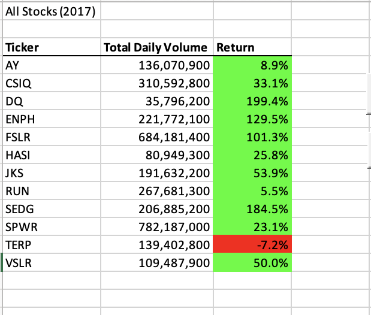
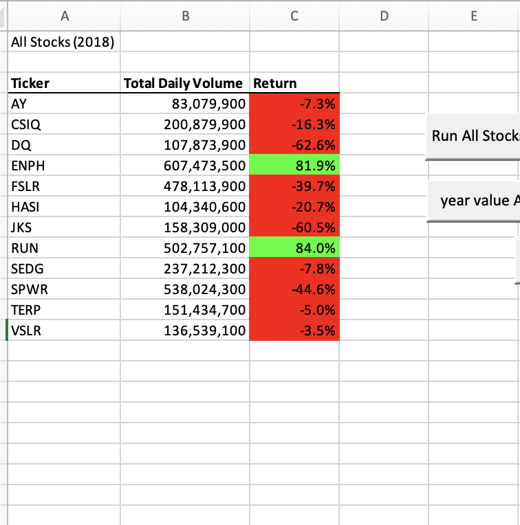
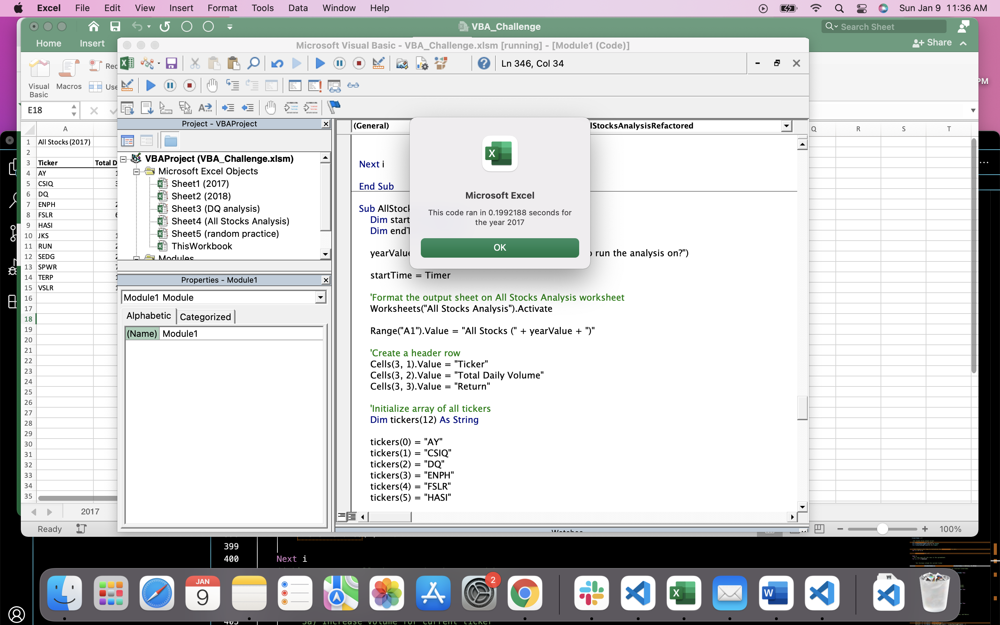

# Refactoring All Stocks Analysis

## Overview of Project

In this project, the goal was to refactor code for a stock analysis I already wrote for Steve in order to analyze his stock 
market data. From this analysis, I could compare the stock market for 2017 and 2018 and also assess how efficently my code 
could execute that information.
The initial code I wrote for Steve worked well for 12 different stocks and it would potentially work for this analysis as well
but if it did, it would take a long time to execute the code. 
The purpose of refactoring this code is to not only have the ability to analyze the entire stock market for both 2017 and
2018, but to do this efficiently. 

## Results

### Comparison of 2017 vs. 2018

In order to run the code over both data sets for 2017 and 2018, a "yearValue" variable was created with an input box that asks you to input the year you wish to run the analysis over. The yearValue variable was used in place of the definitive year when activating the particular worksheet we want the code to pull the data from. When I ran the analysis of all stocks in 2017. The returns for each stock are as shown in the table below

 

It shows that majority of the stocks had a positive return for the year. It was a good year for the stock market in 2017.
Then I ran the analysis of all stocks in 2018. The returns for each stock are as shown in the table below

This table shows that, unlike the analysis of 2017, in 2018 the majority of the stocks had negative returns for the year.
It was not a good year for the stock market in 2018, especially compared to 2017.

### Elapsed time to run intial analysis vs. refactored analysis

When refactoring this code, I added new variables, one being the tickerIndex and added 3 new output arrays for the tickerVolumes, tickerStartingPrice and    tickerEndingPrice. From there I added nested for loops and conditionals to loop through all four arrays and through all of the price data on both data        sheets. 
To see how the refactored analysis compared to the intial analysis, you can look at the All Stocks Analysis sheet in the VBA_Challenge workbook. When running the initial stocks analysis (using the year value All Stocks button), the analysis for both 2017 and 2018 took 0.5625 seconds and 0.5977 seconds respectively.
When running the new refactored code (the Run All Stocks Stocks Analysis Refactored button), the analysis for both 2017 and 2018 took 0.1992 seconds and 0.1562 seconds respectively. You can see these times in the screenshot images below:

This shows that the refactored code did accomplish the goal of running the analysis more efficiently, by decreasing the run time by approximately 0.36               seconds for 2017 and 0.44 seconds for 2018.

## Summary 

### Advantages/Disadvantages of Refactoring Code
One of the advantages to refactoring code is that you can run an analysis more efficiently (in less time). I saw that here in my refactored analysis.               Refactored code is typically easier to understand and it also can make it easier to debug your code as well. It can make the code cleaner, better quality           and more organized as well. It is helpful when you have multiple people needing to peer review the code.
One of the disadvantages to refactoring code is the time it takes up. If you are near a project deadline, it wouldn't be a great time to try to refactor the         code. You also have to worry about the cost it would take to refactor as well. Since the refactoring will take up more time, that would bring an added cost         to the project as well. You would also want to make sure you have enough time to refactor and test the new refactored code, or else there are a risk of             bugs being introduced or errors. This would not be ideal close to a deadline or release date. 

In regards to my VBA refactoring analysis, I feel the refactored code helped me understand better what the code was accomplishing and how it was running             through the data I was analyzing. However, if I looked at how much time it took me to refactor versus saving only 0.3 seconds of run time, I am not sure             that the pros outweighed the cons. If I was looking at a much larger script of code and had other people viewing and editing the code though, I could see           how the refactoring would have been a huge positive and if we were dealing with a much larger data set, the run time saved would have been worth the                 refactoring work.

